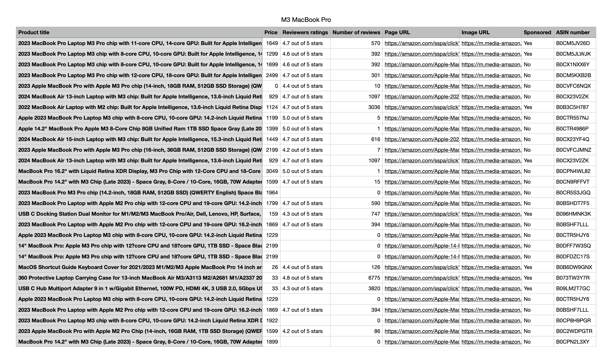

# Scrapeazon

A simple Python script that uses the **requests** and **BeautifulSoup** modules to scrape product data from an e-commerce website.

## Description

**Scrapeazon** allows you to scrape data for a specific product from [**amazon.com**](https://amazon.com) (US version) and save the data into a CSV file for further processing and analysis.

## Disclaimer

This is an unofficial client for retrieving product data from _amazon.com_. Be aware that frequent use of this script may result in your **IP address** being blocked, as Amazon restricts automated bots from scraping its site. **Use at your own risk**.  
I encourage you to use a VPN or a proxy server while using the script to protect yourself from getting banned.
If you got banned while using a VPN or a proxy server, you can switch your server location to change the IP address and it will work again.

## Run locally

Clone the repo to your own machine, create a virtual environment, then run `pip install -r requirements.txt` to install the packages the script need.

## Usage

Type the following into a command line or terminal while you're in the script folder: `py scrapeazon.py`
You will be prompted to search about a product.  
Enter a search keyword/product name to proceed.

```bash
$ py scrapeazon.py
What are you looking for: M3 MacBook Pro
Fetching data, Please wait...

100%|▇▇▇▇▇▇▇▇▇▇|Overall time: 00:10| Total pages downloaded: 20
100%|▇▇▇▇▇▇▇▇▇▇|Extracting data from page: 20/20 web pages.

Your data is ready in ./scrapeazon_scraped_data/M3 MacBook Pro.csv
```

## Script Output

The output of the script is a CSV file named after the search keyword you provided to the script, e.g. `M3 MacBook Pro.csv`  
The file will be saved in a folder called _scrapeazon_scraped_data_, located in the script folder.


An example for a CSV file with more than 400+ records (or 20 pages) being downloaded using the script.

## What's being scraped?

These are the types of data being scraped from amazon.com

| Attribute         | Description                                                           |
| ----------------- | --------------------------------------------------------------------- |
| Product title     | Product title                                                         |
| Price             | Price of the product in US dollars                                    |
| Reviewers ratings | Product rating (from 1 to 5 stars)                                    |
| Number of reviews | Number of people who reviewed the product                             |
| Page URL          | URL of the product's page                                             |
| Image URL         | URL of the product's image (size 3x bigger than the normal thumbnail) |
| Sponsored         | Is the product sponsored ("Yes" or "No")                              |
| ASIN              | Amazon Standard Identification Number                                 |
